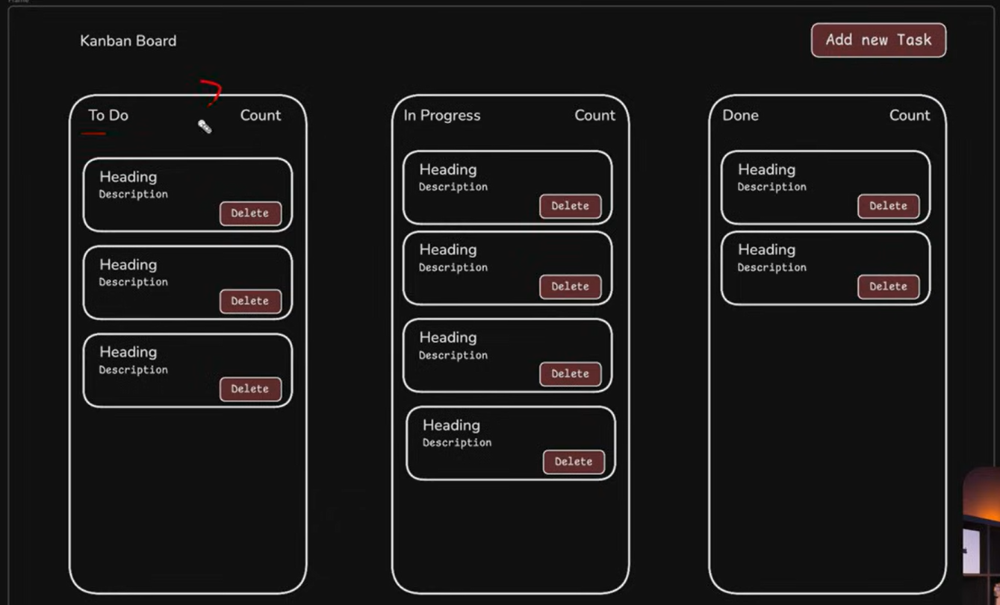

Project divided into 2 parts. 
1. Navbar
2. Columns

Boiler plate html, css Done.

Nav - 
2 divs, left and right (includes text + button)

section -
1 div for board

Made root var in style.css

made task class inside heading for first col

To move button at the end of box
align-self: flex-end 

How do we highlight the column in dragging process(progress col): 
- add in html 'draggable="true"'
- give style(highlight) to column (progress-here)
- add event listeners to progress column (dragenter and dragleave)
  also add class hover-over 
  'progress.addEventListener("dragenter", function (e) {
    this.classList.add("hover-over");
  })'
- we remove the highlight by adding dragleave event, and remove the class 'hover-over'

We can write this for every col, but It'll be repetative.
So
Make a function with 2 events (dragenter, dragleave)

Add 'Drop' event for all cols
<!-- Drop - drops the target  -->
Browser won't allow to drop target on col itself
so we hav to tell browset that 3 cols are the place where target can be dropped.

appendchild adds the target inside col.
and hence we can easily drag and drop target in any col.

Now Main feature is DONE.

ADD NEW TASK 
Create a new div 'modal' for 'add new task'
two divs in modal -bg, -center